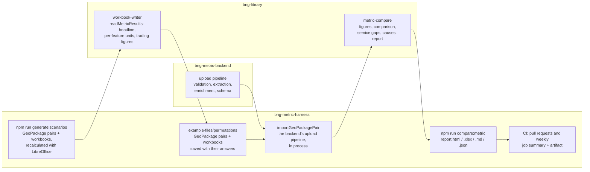

## Comparing the service with the metric

`npm run compare:metric` checks the service's figures against the Statutory
Biodiversity Metric's own answers for the same site (BMD-1036). Every scenario
in the scenario corpus is imported through the backend's upload pipeline. What
the service computes is then compared, figure by figure, with what
the recalculated metric workbook computes for the same GeoPackage pair.

```sh
npm run compare:metric                           # the whole corpus
npm run compare:metric -- --only trading-rules   # a purpose, or scenario ids
npm run compare:metric -- --corpus ~/my-test-spreadsheets   # any folder of scenarios
```

It runs the backend checked out beside this repo, in process, so the backend
needs `npm run install:be` first; `BNG_BACKEND_DIR` names another checkout (a
worktree of a backend branch, say). The report is written to
`metric-comparison/` in this repo:

| File | What it is |
| --- | --- |
| `report.html` | A short summary, in this order: the Met / Not met answers that differ from the metric, the values that differ for no known reason, the known causes of the rest, and what the service doesn't implement yet. Then each scenario, which opens to its full list of differences. Values are shown to 4 decimal places with their unit, and each difference is the service's value less the metric's, in the same unit |
| `report.xlsx` | Every difference at full precision: a summary sheet, a guide to the units and columns, then one row per scenario, per difference and per figure not implemented, each with a frozen, filterable header and real numbers to sort by |
| `report.md` | The same, as Markdown |
| `summary.md` | The report without each scenario's detail (the CI job summary) |
| `report.json` | Every result, for tooling |

**Every value names its unit.** Each discrepancy carries its unit: habitat, hedgerow or watercourse units, % of baseline units for a net change, or Met / Not met for a verdict. A difference is in the same unit, except that two percentages differ by percentage points. Each per-feature row also gives the size the feature was priced on by each side, in ha or km, and the metric's strategic significance multiplier. Both reports open with a guide to every unit and column; in the spreadsheet it is the *Guide* sheet.

**It fails on what nothing explains.** Every difference is reported. Only an
*unexplained* one makes the command exit non-zero, and so fails the build;
the reports are written first, and `summary.md` leads with what failed. See
[What fails the build](#what-fails-the-build). A scenario the service throws an
error on is reported too, as *Import failed in the service* with the error,
and the run carries on with the rest: a crash in the service is a finding like
any other, and fails the build.

### What is compared

| What | Figures |
| --- | --- |
| Unit calculations per feature | Each feature's baseline, retained, enhanced and created units, matched by reference (A-1 to C-3 in the workbook) |
| Unit totals | Baseline, post-intervention and net change, for each module |
| Net gain | Net change (%) and the 10% verdict, for each module the site has |
| Trading rules figures | Each habitat's net change, the Medium broad habitat totals, Medium surplus and deficit, Low net change and the cumulative figure (area and watercourse) |
| Trading rules statuses | Met / Not met for each distinctiveness band |

**The comparison allows only differences too small to matter.** Two numbers
match when they differ by less than 0.001% of the metric's value, or by less
than 0.000001 where the metric's value is zero (`TOLERANCE` in
`bng-library/metric-compare`). The metric shows units and percentages to 2
decimal places, and 0.001% is 0.01 units on a site of 1,000 units, so a
difference inside the tolerance cannot change a project's outcome. What it
clears is floating-point noise: the engine and the spreadsheet add up the same
figures in a different order, so a total can differ in its 14th significant
figure. On the corpus that noise is at most about 1e-13 of the value. Met /
Not met answers must be equal. A match that is not exact is counted in the
report and listed, with its difference, in `report.json`. Every discrepancy is
reported with both values, the difference (service less metric), and that
difference as a share of the metric's value.

**What the service does not do yet** is reported separately from the
discrepancies, with the metric's value. These are hedgerow trading rules, and
the Very High and High band trading rules. Once the service produces one of
those figures, it is compared like any other.

**Known causes.** A feature's units are its size times its multipliers. So
where the service's figure is exactly the metric's rescaled to the service's
size, or with a multiplier the service does not apply divided out, the report
names the cause. The discrepancy still counts, but the ones with no explanation
stand out.

### Where each part lives



- **The metric's answers.** `generate:scenarios` (this repo) writes each
  scenario's workbook, recalculates it with LibreOffice and saves it with its
  calculated values in. The save is normalised, so the same workbook saved
  twice gives the same bytes and Excel has nothing to repair. The comparison
  reads the answers straight from the workbook, with bng-library's own reader:
  the headline figures, every feature's units (with the size and strategic
  significance multiplier they were priced on), and the trading summaries'
  figures. It needs no manifest, and neither LibreOffice nor the Defra template.
- **The scenarios.** They're any folder of files named
  `<name>-baseline.gpkg`, `<name>-post-intervention.gpkg` and `<name>.xlsx`, side
  by side, including hand-built test spreadsheets, not just generated ones.
  - **Values.** A workbook saved from Excel carries its values and is read as
    it is. One saved with formulas only is recalculated first when LibreOffice
    is installed; otherwise it's reported as unreadable.
  - **Feature references.** A hand-built workbook compares feature by feature
    only where its rows' references match the GeoPackages' feature references.
    Totals, net gain and trading are compared regardless.
- **Where the committed scenarios live.** They're only in this repo's
  `example-files/permutations/`, each GeoPackage pair beside its workbook.
  Neither the library nor the backend carries a copy, so no library consumer
  pulls in test data. `--corpus` names another folder.
- **The comparison.** bng-library's `metric-compare` turns each side into
  comparable figures and compares them.
- **The service's answers.** `importGeoPackagePair`
  (`scripts/metric-comparison/`) runs the same code the backend's validate
  route does, in the same order, without S3, the worker pool or a database.
  That code is the format gate, the GEOS geometry checks, the data-quality
  checks, feature IDs, sizing, extraction, enrichment and the schema. It is
  the backend's own: each module is imported from the backend checkout, and
  resolves its dependencies, the engine included, from the backend's
  `node_modules` at the version the backend pins. Nothing is copied, so the
  comparison measures what the service would deploy. It returns the body
  `GET /projects/{id}` would return. The whole corpus runs in a few seconds.
  - The backend exports what the import calls (`runDataQualityChecks`,
    `layersForUpload`, `extractAndValidateDocument`, `saveHandlersForConfig`,
    DEFRA/bng-metric-backend#417). A backend that predates them fails with a
    message saying so.
  - **Without an installed backend** the command stops with a pointer to
    `npm run bootstrap` and `npm run install:be`, and the comparison's tests
    (`tests/scripts/metric-comparison/`) skip.

### Why it lives in the harness

The figures under test come from three repos: the scenarios and the metric's
answers here, the engine in bng-library, and the extraction and enrichment in
the backend. The harness is where the three already meet, with the scenarios
committed and the siblings checked out beside it, so the comparison lives here
and imports the backend rather than the backend fetching the scenarios. The
backend keeps only the few exports the import needs.

- **Every pull request** here (`check-pull-request.yml`) checks the backend
  out beside the harness, installs it, and runs `npm run compare:metric`, in a
  job of its own beside the Sonar scan. A
  pull request whose branch also exists in the backend uses that branch, so a
  scenario change here and a backend change can be tested together before
  either is merged. Otherwise, it's the backend's `main`. The summary goes on
  the job summary. The full report (`report.html` and `report.xlsx`) goes in
  the `metric-comparison` artifact.
- **Every Monday** the same workflow's schedule re-runs it against the
  backend's `main`, so a change that reached the service since is in that
  week's report. A backend change does not trigger it; to see a backend
  branch's report, run it locally with `BNG_BACKEND_DIR`, or open a harness
  pull request from a branch of the same name.
- The job fails when a difference has no known explanation, or when the
  comparison cannot run (a failed clone or install, or a backend that
  predates its exports). It is a job of its own, so it never skips the Sonar
  scan. On a pull request whose branch is not in the backend, the comparison
  runs the backend's `main`, so that has to be free of unexplained
  differences too.
- `npm run test:scripts` checks that the comparison itself runs, and the rules
  for what is explained (`tests/scripts/metric-comparison/unexplained.test.mjs`).
- bng-library's own CI tests the comparator, the workbook reader and the
  reports.

### What fails the build

`scripts/metric-comparison/unexplained.mjs` decides which differences have a
known explanation. A difference is explained when:

| Difference | Explained when |
| --- | --- |
| A feature's units | Every cause bng-library finds for it is one the service does not implement yet: today, strategic significance. *Priced on a different size* explains nothing: the service has fixed it, so it would be a regression. |
| A total, net gain figure or verdict, or trading rules figure or status | Its module's feature units differ, all of them for a cause not implemented yet. These figures are sums of the feature units, so they inherit the difference. In a module whose features all match, a differing total is unexplained. |
| Any figure in a scenario built on invalid data that the service accepts | `VALIDATION_GAPS` names the scenario and the check the service does not make yet. The metric computes nothing meaningful for invalid rows. |

Everything else fails:
- a figure that differs for no known reason;
- a figure one side has and the other does not;
- a valid scenario the service refuses;
- an import that crashes;
- a workbook that cannot be read;
- an invalid scenario the service accepts with no entry in `VALIDATION_GAPS`.

When the service starts refusing an invalid scenario, its `VALIDATION_GAPS`
entry is reported as stale (a warning, not a failure), so it can be removed.
When the service implements strategic significance, the cause stops matching
and its differences go away, so nothing needs updating here.

To accept a new kind of expected difference, explain it in `unexplained.mjs`
(or, for a feature's units, as a cause in bng-library's
`metric-compare/causes.mjs` with `notImplemented: true`). Do not record it as
an exception without a reason. bng-library's `knownDiscrepanciesFrom` and
`findRegressions` can also record a run's discrepancies and fail on any change
to them, if explained differences ever need pinning down too.

### Refreshing the corpus

After changing the scenario catalogue, the workbook reader, or the metric
template, regenerate it and commit the result here:

```sh
npm run lib:link                     # use the local bng-library
npm run generate:scenarios -- --outdir example-files/permutations --seed 1
npm run compare:metric               # compares the new corpus at once
```

### What the comparison finds

On the seed-1 corpus of 37 scenarios, now that the service prices the measured
size:

- 17 scenarios have discrepancies. The other 12 valid scenarios match the
  metric in every figure: the 3 trading-rules scenarios that always did, and 9
  more whose only differences were floating-point noise in their totals.
- `invalid-area-advance-and-delay` is refused by the service, as expected.
- The other 7 scenarios built on invalid data are accepted by the service. They
  are reported as "Accepted, though its data is invalid", with their
  discrepancies, because the service should have refused them.
- 1,305 of 1,813 comparable figures match: 1,186 exactly and 119 within the
  tolerance. 508 differ.
- 540 figures are not implemented in the service yet.

Of the 180 per-feature discrepancies, 179 have a known cause:

| Cause | Discrepancies | |
| --- | --- | --- |
| Strategic significance not applied | 179 | The engine prices every feature at a strategic significance multiplier of 1 (`BASELINE_STRATEGIC_SIGNIFICANCE_MULTIPLIER`). The metric applies 1.1 or 1.15, so affected features are 9.1% or 13.0% lower in the service. This is enough to flip a net gain verdict: in `intervention-hedgerow-retained` the hedgerow net change is 10.72% (Met) in the metric and 9.97% (Not met) in the service. |

Every other discrepancy, in totals, net gain and trading rules, is in one of
the 17 scenarios with strategic significance or in an invalid-data scenario.
No other scenario differs from the metric.

The service used to round each area to the whole m² and each
length to the whole metre before pricing it, where the metric prices the
measured size: 488 per-feature discrepancies, up to 0.005 units each. The
service now prices the measured size, and the service and the workbooks both
measure it with `bng-library/measure`, one definition of a feature's size, so
none remain; the *Priced on a different size* cause is kept to catch it coming
back.

The one without a known cause is **`invalid-area-trading-down`** H001. The
metric computes nothing for this enhancement (it breaks the trading-down rule),
while the service prices it. That is expected until enhancement rules are
validated, which is out of scope for BMD-1036.
