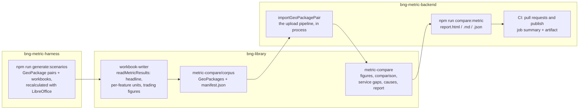

## Comparing the service with the metric

`npm run compare:metric` checks the service's figures against the Statutory
Biodiversity Metric's own answers for the same site (BMD-1036). Every scenario
in the scenario corpus is imported through the backend's upload pipeline. What
the service computes is then compared, figure by figure and exactly, with what
the recalculated metric workbook computes for the same GeoPackage pair.

```sh
npm run compare:metric                           # the whole corpus
npm run compare:metric -- --only trading-rules   # a purpose, or scenario ids
npm run compare:metric -- --corpus ../bng-metric-harness/test-data/scenarios
```

This proxies to the backend's `npm run compare:metric`. The report is written to
`bng-metric-backend/metric-comparison/`:

| File | What it is |
| --- | --- |
| `report.html` | The full report as one self-contained page. Every discrepancy, filterable by what was compared, by module, and to the ones no known cause explains |
| `report.xlsx` | The same as a spreadsheet: a summary sheet, then one row per scenario, per discrepancy and per figure not implemented, each with a frozen, filterable header and real numbers to sort by |
| `report.md` | The same, as Markdown |
| `summary.md` | The report without each scenario's detail (the CI job summary) |
| `report.json` | Every result, for tooling |

**Every value names its unit.** Each discrepancy carries its unit: habitat, hedgerow or watercourse units, % of baseline units for a net change, or Met / Not met for a verdict. A difference is in the same unit, except that two percentages differ by percentage points. Each per-feature row also gives the size the feature was priced on by each side, in ha or km, and the metric's strategic significance multiplier. Both reports open with a guide to every unit and column; in the spreadsheet it is the *Guide* sheet.

**It reports; it does not judge.** Differences never make the command or a
build fail. The report is there for people to decide what, if anything, needs
doing.

### What is compared

| What | Figures |
| --- | --- |
| Unit calculations per feature | Each feature's baseline, retained, enhanced and created units, matched by reference (A-1 to C-3 in the workbook) |
| Unit totals | Baseline, post-intervention and net change, for each module |
| Net gain | Net change (%) and the 10% verdict, for each module the site has |
| Trading rules figures | Each habitat's net change, the Medium broad habitat totals, Medium surplus and deficit, Low net change and the cumulative figure (area and watercourse) |
| Trading rules statuses | Met / Not met for each distinctiveness band |

**The comparison is exact.** Both sides carry 15 significant figures: the
engine rounds every result to that, and LibreOffice exports the recalculated
values at that precision. Each number is taken to 15 significant figures, and
then the two must be equal. Every discrepancy is reported with both values, the
difference (service less metric), and that difference as a share of the
metric's value.

**What the service does not do yet** is reported separately from the
discrepancies, with the metric's value. These are hedgerow trading rules, and
the Very High and High band trading rules. Once the service produces one of
those figures, it is compared like any other.

**Known causes.** A feature's units are its size times its multipliers. So
where the service's figure is exactly the metric's rescaled to the service's
size, or with a multiplier the service does not apply divided out, the report
names the cause. The discrepancy still counts, but the ones with no explanation
stand out.

### Where each part lives



- **The metric's answers.** `generate:scenarios` (this repo) writes each
  scenario's workbook and recalculates it. bng-library's `readMetricResults`
  reads the headline figures, every feature's units (with the size and strategic
  significance multiplier they were priced on), and the trading summaries'
  figures into `manifest.json`.
- **The corpus.** bng-library holds a copy of the corpus, trimmed to the
  GeoPackages and the manifest (`src/metric-compare/corpus`, about 6 MB). The
  workbooks are not needed downstream, because their answers are in the
  manifest. So neither LibreOffice nor the Defra template is needed to run the
  comparison.
- **The comparison.** bng-library's `metric-compare` turns each side into
  comparable figures and compares them.
- **The service's answers.** The backend's `importGeoPackagePair` runs the same
  code the validate route does, in the same order, without S3, the worker pool
  or a database. That code is the format gate, the GEOS geometry checks, the
  data-quality checks, feature IDs, sizing, extraction, enrichment and the
  schema. It returns the body `GET /projects/{id}` would return. The whole
  corpus runs in a couple of seconds.

### Why it runs in the backend's CI

The figures under test come from two places: the engine in bng-library, and the
backend's extraction and enrichment around it. The backend is the only repo that
has both. A library change reaches the service only when the backend's
`bng-library` pin is bumped, and that bump is a backend pull request. So the
comparison runs there, where a change's report can be read before it lands.

- **Every pull request** (`check-pull-request.yml`) runs `npm run compare:metric`.
  The summary goes on the job summary. The full report (`report.html` and `report.xlsx`)
  goes in the `metric-comparison` artifact.
- **Every publish** (`publish.yml`, on each push to main) does the same, so the
  sample spreadsheets are re-evaluated for each commit that reaches main. It
  never holds up a publish.
- `npm test` checks that the comparison itself runs (`metric-comparison.test.js`),
  not what it finds.
- bng-library's own CI tests the comparator, the workbook reader, the reports
  and the committed corpus.

### Failing a build later

For now nothing fails. When some differences should fail a build (a new
discrepancy, say, or any in trading statuses), bng-library already has what a
gate needs. `knownDiscrepanciesFrom(results)` records a run's discrepancies,
with both values. `findRegressions(results, known)` lists every way a later run
differs from that record: a new or changed discrepancy, one that has gone, or a
change of outcome.

### Refreshing the corpus

After changing the scenario catalogue, the workbook reader, or the metric
template:

```sh
npm run lib:link                     # use the local bng-library
npm run generate:scenarios -- --outdir example-files/permutations --seed 1
(cd ../bng-library && npm run corpus:import -- ../bng-metric-harness/example-files/permutations)
npm run compare:metric
```

### What the first run found

On the seed-1 corpus of 37 scenarios:

- 36 scenarios have discrepancies.
- `invalid-area-advance-and-delay` is refused by the service, as expected.
- 551 of 1,813 comparable figures match exactly.
- 540 figures are not implemented in the service yet.

Of the 578 per-feature discrepancies, 561 have a known cause:

| Cause | Discrepancies | |
| --- | --- | --- |
| Sizes rounded before pricing | 347 (+140 with the next) | The backend rounds each area to the whole m² and each length to the whole m (`Math.round(feature.sizeMetres)`) before pricing. The metric prices the measured size. The effect is small (a median of 0.0004%, up to 0.9% on the shortest features), but it is not exact. |
| Strategic significance not applied | 74 (+140 with the above) | The engine prices every feature at a strategic significance multiplier of 1 (`BASELINE_STRATEGIC_SIGNIFICANCE_MULTIPLIER`). The metric applies 1.1 or 1.15, so affected features are 9.1% or 13.0% lower in the service. This is enough to flip a net gain verdict: `intervention-hedgerow-retained` is Met in the service at 10.01% and Not met in the metric at 9.09%. |

The 17 without a known cause are worth investigating first:

- **Created trees** (`T005` in 15 scenarios). The workbook reads a year of
  advance creation from the tree's row that the service does not, and prices the
  tree's time to target as "30+" where the service has "30". One of the tree
  advance/delay columns is read differently on the two sides.
- **Created habitats priced with a different difficulty**, for example
  `intervention-watercourse-created` H005 (Reservoirs). The metric applies
  Medium difficulty (×0.67); the service applies Low (×1).
- **`invalid-area-trading-down`** H001. The metric computes nothing for this
  enhancement (it breaks the trading-down rule), while the service prices it.
  That is expected until enhancement rules are validated, which is out of scope
  for BMD-1036.
