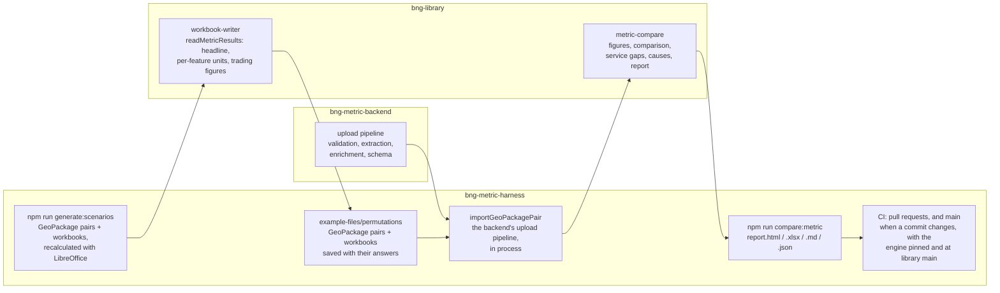

## Comparing the service with the metric

`npm run compare:metric` checks the service's figures against the Statutory
Biodiversity Metric's own answers for the same site (BMD-1036). Every scenario
in the scenario corpus is imported through the backend's upload pipeline. What
the service computes is then compared, figure by figure, with what
the recalculated metric workbook computes for the same GeoPackage pair.

```sh
npm run compare:metric                           # the whole corpus
npm run compare:metric -- --only trading-rules   # a purpose, or scenario ids
npm run compare:metric -- --corpus ~/my-test-spreadsheets   # any folder of scenarios
```

It runs the backend checked out beside this repo, in process, so the backend
needs `npm run install:be` first; `BNG_BACKEND_DIR` names another checkout (a
worktree of a backend branch, say). The report is written to
`metric-comparison/` in this repo:

| File | What it is |
| --- | --- |
| `report.html` | A short summary, in this order: the Met / Not met answers that differ from the metric, the values that differ for no known reason, the known causes of the rest, and what the service doesn't implement yet. Then each scenario, which opens to its full list of differences. Values are shown to 4 decimal places with their unit, and each difference is the service's value less the metric's, in the same unit |
| `report.xlsx` | Every difference at full precision: a summary sheet, a guide to the units and columns, then one row per scenario, per difference and per figure not implemented, each with a frozen, filterable header and real numbers to sort by |
| `report.md` | The same, as Markdown |
| `summary.md` | The report without each scenario's detail (the CI job summary) |
| `report.json` | Every result, for tooling |

**Every value names its unit.** Each discrepancy carries its unit: habitat, hedgerow or watercourse units, % of baseline units for a net change, or Met / Not met for a verdict. A difference is in the same unit, except that two percentages differ by percentage points. Each per-feature row also gives the size the feature was priced on by each side, in ha or km, and the metric's strategic significance multiplier. Both reports open with a guide to every unit and column; in the spreadsheet it is the *Guide* sheet.

**It singles out what nothing explains.** Every difference is reported, and
the reports lead with the *unexplained* ones. With `--fail-on-unexplained`, an
unexplained difference also makes the command exit non-zero, after the reports
are written. CI passes that flag; see
[What fails the build](#what-fails-the-build). A scenario the service throws an
error on is reported too, as *Import failed in the service* with the error,
and the run carries on with the rest: a crash in the service is a finding like
any other, and is unexplained.

### What is compared

| What | Figures |
| --- | --- |
| Unit calculations per feature | Each feature's baseline, retained, enhanced and created units, matched by reference (A-1 to C-3 in the workbook) |
| Unit totals | Baseline, post-intervention and net change, for each module |
| Net gain | Net change (%) and the 10% verdict, for each module the site has |
| Trading rules figures | Each habitat's net change, the Medium broad habitat totals, Medium surplus and deficit, Low net change and the cumulative figure (area and watercourse) |
| Trading rules statuses | Met / Not met for each distinctiveness band |

**The comparison allows only floating-point noise.** Two numbers match when
they differ by less than 1e-12 of the metric's value, or by less than 1e-12
where the metric's value is zero (`TOLERANCE` in
`bng-library/metric-compare`). It is not sized by what could change a
project's outcome: a difference too small for that, such as pricing a size
rounded to the whole square metre, is still the service calculating
differently, so it is a discrepancy. What the tolerance clears is noise: the engine and the spreadsheet add up the same
figures in a different order, so a total can differ in its 14th significant
figure. On the corpus that noise is at most about 1e-13 of the value. Met /
Not met answers must be equal. A match that is not exact is counted in the
report and listed, with its difference, in `report.json`. Every discrepancy is
reported with both values, the difference (service less metric), and that
difference as a share of the metric's value.

**What the service does not do yet** is reported separately from the
discrepancies, with the metric's value. These are hedgerow trading rules, and
the Very High and High band trading rules. Once the service produces one of
those figures, it is compared like any other.

**Known causes.** A feature's units are its size times its multipliers. So
where the service's figure is exactly the metric's rescaled to the service's
size, or with a multiplier the service does not apply divided out, the report
names the cause. The discrepancy still counts, but the ones with no explanation
stand out.

### Where each part lives



- **The metric's answers.** `generate:scenarios` (this repo) writes each
  scenario's workbook, recalculates it with LibreOffice and saves it with its
  calculated values in. The save is normalised, so the same workbook saved
  twice gives the same bytes and Excel has nothing to repair. The comparison
  reads the answers straight from the workbook, with bng-library's own reader:
  the headline figures, every feature's units (with the size and strategic
  significance multiplier they were priced on), and the trading summaries'
  figures. It needs no manifest, and neither LibreOffice nor the Defra template.
- **The scenarios.** They're any folder of files named
  `<name>-baseline.gpkg`, `<name>-post-intervention.gpkg` and `<name>.xlsx`, side
  by side, including hand-built test spreadsheets, not just generated ones.
  - **Values.** A workbook saved from Excel carries its values and is read as
    it is. One saved with formulas only is recalculated first when LibreOffice
    is installed; otherwise it's reported as unreadable.
  - **Feature references.** A hand-built workbook compares feature by feature
    only where its rows' references match the GeoPackages' feature references.
    Totals, net gain and trading are compared regardless.
- **Where the committed scenarios live.** They're only in this repo's
  `example-files/permutations/`, each GeoPackage pair beside its workbook.
  Neither the library nor the backend carries a copy, so no library consumer
  pulls in test data. `--corpus` names another folder.
- **The comparison.** bng-library's `metric-compare` turns each side into
  comparable figures and compares them.
- **The service's answers.** `importGeoPackagePair`
  (`scripts/metric-comparison/`) runs the same code the backend's validate
  route does, in the same order, without S3, the worker pool or a database.
  That code is the format gate, the GEOS geometry checks, the data-quality
  checks, feature IDs, sizing, extraction, enrichment and the schema. It is
  the backend's own: each module is imported from the backend checkout, and
  resolves its dependencies, the engine included, from the backend's
  `node_modules` at the version the backend pins. Nothing is copied, so the
  comparison measures what the service would deploy. It returns the body
  `GET /projects/{id}` would return. The whole corpus runs in a few seconds.
  - The backend exports what the import calls (`runDataQualityChecks`,
    `layersForUpload`, `extractAndValidateDocument`, `saveHandlersForConfig`,
    DEFRA/bng-metric-backend#417). A backend that predates them fails with a
    message saying so.
  - **Without an installed backend** the command stops with a pointer to
    `npm run bootstrap` and `npm run install:be`, and the comparison's tests
    (`tests/scripts/metric-comparison/`) skip.

### Why it lives in the harness

The figures under test come from three repos: the scenarios and the metric's
answers here, the engine in bng-library, and the extraction and enrichment in
the backend. The harness is where the three already meet, with the scenarios
committed and the siblings checked out beside it, so the comparison lives here
and imports the backend rather than the backend fetching the scenarios. The
backend keeps only the few exports the import needs.

All of it is `metric-comparison.yml`, a workflow of its own, so nothing it
does can skip the Sonar scan in `check-pull-request.yml`.

- **Every pull request** here checks the backend out beside the harness,
  installs it, and runs `npm run compare:metric -- --fail-on-unexplained`. A
  pull request whose branch also exists in the backend uses that branch, so a
  scenario change here and a backend change can be tested together before
  either is merged. Otherwise, it's the backend's `main`. The summary goes on
  the job summary. The full report (`report.html` and `report.xlsx`) goes in
  the `metric-comparison-library-pinned` artifact (`-main` for the other
  leg, below).
- **On `main`, with the engine tried twice.** The backend pins bng-library
  to a commit, so a library change reaches the service, and the comparison,
  only when that pin moves. So on `main` the comparison runs as two legs, one
  job each, named by the engine they use:
  - **library pinned**: the engine at the backend's pin, which is what the
    service deploys. A failure is a regression in the service.
  - **library main**: the same backend with the engine swapped, in its
    `node_modules`, for bng-library's `main` (`npm install --no-save`, so
    the backend's lockfile is untouched). A failure is a library change that
    would regress the service when the backend next repins, caught before it
    does. Pull requests don't run this leg: a library change the backend
    hasn't adopted shouldn't block a change here.

  The harness's own bng-library pin, the comparator and workbook reader, is
  the measuring instrument and stays as it is on both legs. The frontend
  plays no part, so it isn't watched.
- **Only when one of its commits is new.** The workflow runs on each harness
  merge and three times each weekday (06:17, 12:17 and 15:17 UTC), and each
  leg compares only if the
  commits it would compare (the backend's `main`, the harness's and, for the
  main leg, the library's `main`) have not been compared before. A harness
  merge always compares both legs, its commit being new; a backend merge is
  in the next scheduled run's report, as is a library merge on the main leg;
  a run with nothing new stops after a few seconds and says so on its job
  summary.
- Each comparison that ran to the end is recorded in the Actions cache, keyed
  by its commits, whether it passed or not: a regression fails one run, not
  on every run until it is fixed. A comparison that never finished (a failed
  clone or install) is not recorded, so the next run tries again. The cache
  forgets a key unused for 7 days, which costs one extra comparison.
- **Anything a person starts always compares.** Only an automatic run (a
  merge or the schedule) on its first attempt can skip. Running the workflow
  by hand from the Actions tab, or re-running any run ("Re-run all jobs" or
  "Re-run failed jobs"), always compares both legs. To see a backend
  branch's report, run it locally with `BNG_BACKEND_DIR`, or open a harness
  pull request from a branch of the same name.
- An unexplained difference fails the job, and so the workflow; so does a
  comparison that cannot run (a failed clone or install, or a backend that
  predates its exports). The Sonar scan is in another workflow and still runs.
  Unexplained differences lead the job summary: see below.
- `npm run test:scripts` checks that the comparison itself runs, and the rules
  for what is explained (`tests/scripts/metric-comparison/unexplained.test.mjs`).
- bng-library's own CI tests the comparator, the workbook reader and the
  reports.

### What fails the build

Any unexplained difference. CI runs
`npm run compare:metric -- --fail-on-unexplained`, which writes the reports and
then exits 1 if anything is unexplained. Locally, pass the same flag to see
whether a run would pass.

`scripts/metric-comparison/unexplained.mjs` decides which differences have a
known explanation. A difference is explained when:

| Difference | Explained when |
| --- | --- |
| A feature's units | Every cause bng-library finds for it is one the service does not implement yet: today, strategic significance. *Priced on a different size* explains nothing: the service has fixed it, so it would be a regression. |
| A unit total | Its module's feature units differ, all of them for a cause not implemented yet, and the total differs by exactly what those differences add up to: the baseline total by the baseline features' differences, the post-intervention total by the retained, enhanced and created features', and the net change by the second less the first. A total that moves further than its features do is unexplained, as is a differing total in a module whose features all match. |
| The net change percentage and net gain verdict | The module's totals all reconcile as above, and the service's percentage is the metric's recomputed on totals moved by that much. The verdict is explained only where that percentage differs, since the service's verdict follows from its percentage. |
| A trading rules figure or status | The module's totals all reconcile as above. The feature figures do not say which habitat or band a feature is in, so trading figures cannot yet be reconciled feature by feature; this is the weakest of the checks. |
| Any figure in a scenario built on invalid data that the service accepts | `VALIDATION_GAPS` names the scenario and the check the service does not make yet. The metric computes nothing meaningful for invalid rows. |

Everything else is unexplained:
- a figure that differs for no known reason;
- a figure one side has and the other does not;
- a valid scenario the service refuses;
- an import that crashes;
- a workbook that cannot be read;
- an invalid scenario the service accepts with no entry in `VALIDATION_GAPS`.

When the service starts refusing an invalid scenario, its `VALIDATION_GAPS`
entry is reported as stale (a warning, not a failure), so it can be removed.
Strategic significance should soon explain nothing. The corpus follows the
LNRS guidance (Low baselines; Low or High proposed values), and once
bng-metric-backend#439 (hedgerows read their proposed value) has merged, no
difference has that cause. bng-library should then stop treating it as *not
implemented yet*, so a strategic significance difference fails like any other.

To accept a new kind of expected difference, explain it in `unexplained.mjs`
(or, for a feature's units, as a cause in bng-library's
`metric-compare/causes.mjs` with `notImplemented: true`). Do not record it as
an exception without a reason. bng-library's `knownDiscrepanciesFrom` and
`findRegressions` can also record a run's discrepancies and fail on any change
to them, if explained differences ever need pinning down too.

### Refreshing the corpus

After changing the scenario catalogue, the workbook reader, or the metric
template, regenerate it and commit the result here:

```sh
npm run lib:link                     # use the local bng-library
npm run generate:scenarios -- --outdir example-files/permutations --seed 1
npm run compare:metric               # compares the new corpus at once
```

### What the comparison finds

On the seed-1 corpus of 37 scenarios, against the backend with
bng-metric-backend#426 (sizes measured, unrounded) and #439 (hedgerows read
their proposed strategic significance):

- **All 29 valid scenarios match the metric**, in every figure compared.
- `invalid-area-advance-and-delay` is refused by the service, as expected.
- The other 7 scenarios built on invalid data are accepted by the service. They
  are reported as "Accepted, though its data is invalid", because the service
  should have refused them; each is listed in `VALIDATION_GAPS`. Two of them
  are the only scenarios with differing figures:
  - **`invalid-area-trading-down`** H001: the metric computes nothing for this
    enhancement (it breaks the trading-down rule), while the service prices it.
  - **`invalid-watercourse-encroachment-worsened`**: the metric reports *Check
    Data* and *N/A*, while the service computes its totals.
- 1,793 of 1,804 comparable figures match: 1,589 exactly and 204 within the
  tolerance. The 11 that differ are all in those two scenarios.
- 544 figures are not implemented in the service yet.

How it got here:

| Was | Differences | What changed |
| --- | --- | --- |
| Sizes rounded before pricing | 488 per-feature, up to 0.005 units each | The service prices the measured size, unrounded, and the service and the workbooks both measure it with `bng-library/measure` (BMD-1042). The *Priced on a different size* cause is kept to name it if it comes back. |
| Floating-point noise in totals | 38 figures, up to about 1e-13 of the value | Figures match within a tolerance of 1e-12 of the metric's value (BMD-1042). |
| Baseline strategic significance | about 160 per-feature, and the totals and verdicts they flipped | The service prices every baseline at Low, as Defra's LNRS guidance requires; the corpus gave baselines High or Medium. It now follows the guidance (bng-library#68). |
| Hedgerows' proposed strategic significance | 18 per-feature | The service never read a hedgerow's Proposed Strategic Significance, so priced it at Low (bng-metric-backend#439). |
| A habitat the metric spells two ways | 2 trading figures | "Ruderal/ephemeral" and "Ruderal/Ephemeral" are matched as one habitat (bng-library#68). |

Until #439 merges, a run against the backend's `main` or #426 alone shows the
hedgerow differences, explained as *Strategic significance not applied*.
