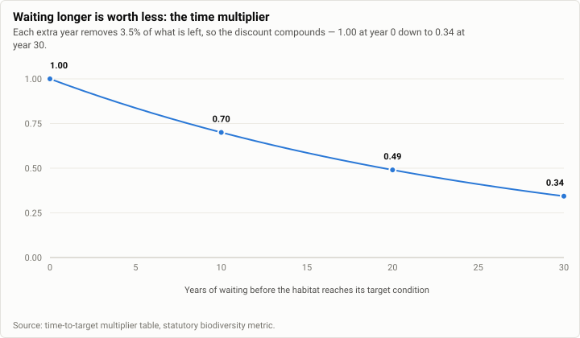
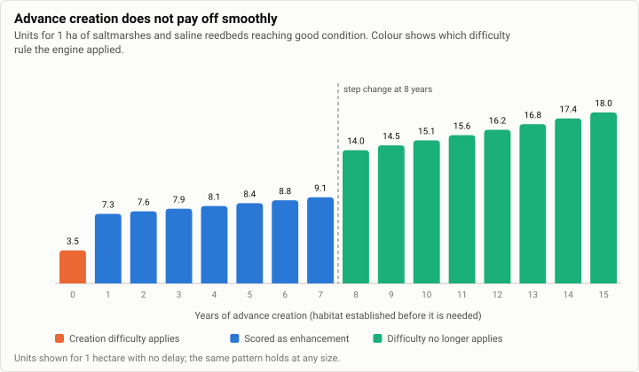
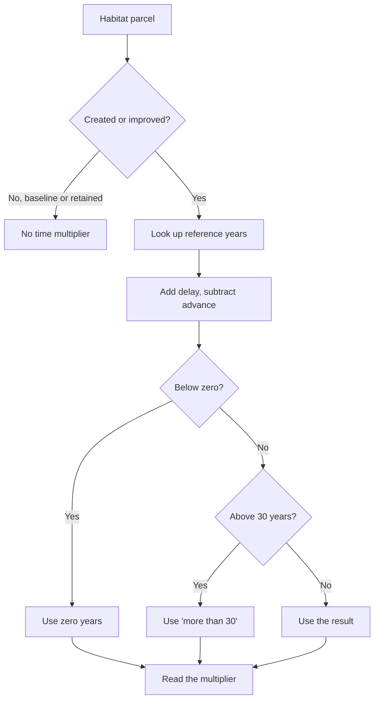
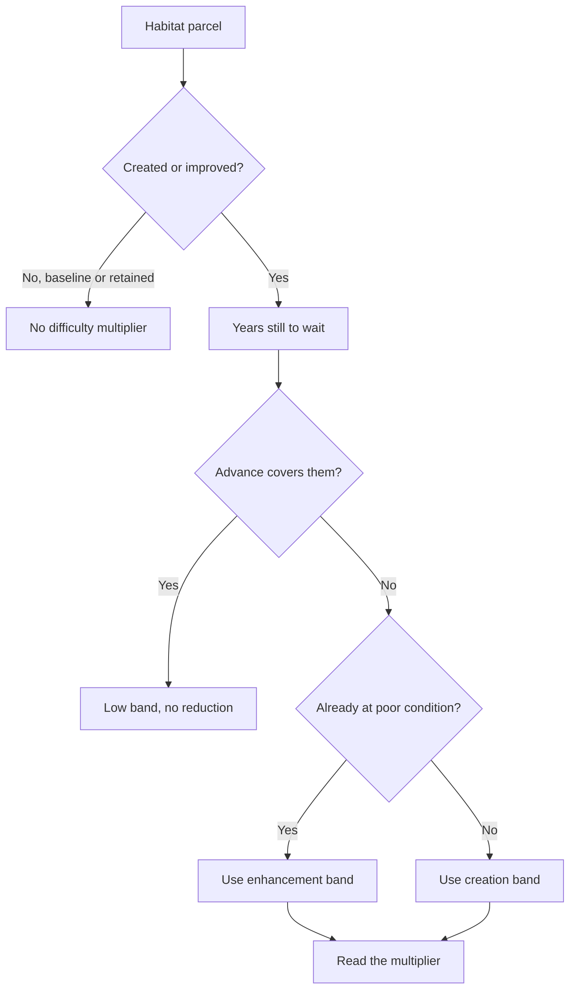
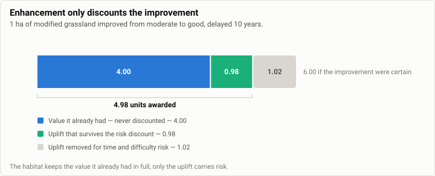

# How the BNG rules engine decides a habitat's value

> **This page is generated, not hand-written.** It is produced by the
> `rules-engine-explainer` skill in the `bng-metric-harness` repository, and every
> multiplier and unit figure on it comes from running the real engine rather than
> from reading the reference tables by eye. If something here is wrong, fix the
> generator — an edit made directly to this page will be overwritten the next time
> it runs.
>
> Engine version 0.0.0, from commit `d02823c` (27 July 2026). Generated 27 July 2026.

## In one paragraph

The rules engine turns a parcel of habitat into a number of **biodiversity units**.
It starts from how big the parcel is, multiplies that by how ecologically valuable
that habitat type is and what state it is in, and then — only where the habitat is
being created or improved rather than simply left alone — reduces the answer to
reflect the risk that the promised habitat does not arrive. Two things drive that
reduction: how many years the habitat will take to reach its target condition, and
how hard that type of habitat is to establish. Everything below is about how the
engine picks those two numbers.

## The shape of every calculation

Every unit figure has the same skeleton:

**size × how valuable the habitat type is × what state it is in × risk adjustments**

The first three terms set the headline value. The risk adjustments are two
multipliers — one for time, one for difficulty — each between 0 and 1, so they can
only ever reduce the headline figure, never increase it.

The important thing to understand first is **when the risk adjustments apply at
all**:

| Situation | Risk adjustments applied? |
| --- | --- |
| Baseline — habitat already on site before the development | No |
| Retained — habitat left untouched by the development | No |
| Created — new habitat made where there was none | Yes, to the whole parcel |
| Enhanced — existing habitat improved | Yes, but **only to the improvement** |

Baseline and retained habitat carry no risk adjustment because nothing is being
predicted. The habitat is already there, already in the state recorded. There is no
waiting and no delivery risk to discount, so the engine does not apply any.

## The four inputs that set the value

### Distinctiveness — how valuable this habitat type is

A fixed judgement about the habitat type itself, taken from the statutory tables. It
does not depend on condition, location or anything the developer does. Each of the
132 area habitat types sits in one of five bands:

| Band | Score |
| --- | --- |
| V.High | 8 |
| High | 6 |
| Medium | 4 |
| Low | 2 |
| V.Low | 0 |

Note the bottom band scores **zero**. Six habitat types sit there: four urban
categories including sealed surfaces and built linear features, plus artificial hard
structures with integrated greening, and watercourse footprint. Any parcel of those
is worth zero units no matter how large or how well maintained, and the engine
reports that without complaint.

### Condition — what state this particular parcel is in

An assessment of this specific parcel against criteria for its habitat type. The
possible scores are 3 (good), 2.5 (fairly good), 2 (moderate), 1.5 (fairly poor) and
1 (poor). A sixth band, "N/A - Other", scores 0.

Not every condition is available for every habitat. Where the statutory tables mark
a habitat-and-condition pairing as impossible, the engine **rejects the calculation
outright** rather than quietly scoring it as zero.

### Time — how long until the habitat is as promised

The first of the two risk adjustments. Covered in full in the next section.

### Difficulty — how hard this habitat is to establish

The second risk adjustment. Four bands, and unlike distinctiveness the band depends
on whether the habitat is being created from scratch or improved from something
already there:

| Band | Multiplier | Meaning |
| --- | --- | --- |
| Low | 1 | No reduction at all |
| Medium | 0.67 | Keeps about two thirds of the value |
| High | 0.33 | Keeps about a third |
| Very High | 0.1 | Keeps a tenth |

## How the engine picks the time multiplier

Four steps.

**Step one — look up how many years it should take.** The statutory tables give a
number of years for the habitat to reach the target condition. Creation and
enhancement use different tables. For creation the answer depends only on the target
condition. For enhancement it depends on the starting condition as well, because
improving poor grassland to good is a different journey from improving moderate
grassland to good.

**Step two — add delay, subtract advance.** Delay years push the finish line further
out; advance years mean the habitat was established early and is further along. They
combine into a single figure: the reference years, plus any delay, minus any advance.

**Step three — apply the limits.** The result can never go below zero. Anything
beyond 30 years falls into a single "more than 30 years" band, so a 31-year wait and
a 300-year wait are treated identically. Advance and delay are each capped at 30
years, and a larger figure is rejected rather than trimmed.

**Step four — read off the multiplier.** The number of years maps to a multiplier.

The shape of that mapping is the useful thing to know: **each additional year of
waiting removes 3.5% of what is left**, so the discount compounds rather than
accumulating in a straight line.

| Years of waiting | Multiplier |
| --- | --- |
| 0 | 1 |
| 1 | 0.965 |
| 10 | 0.7002822742 |
| 20 | 0.4903952635 |
| 30 | 0.3434151104 |
| More than 30 | 0.3197967361 |

Two things fall out of this. Waiting 30 years still leaves about a third of the
value, not nothing. And pushing past 30 years costs very little extra — the gap
between 30 years and "more than 30" is smaller than a single year's step early on.

## How the engine picks the difficulty multiplier

This is the subtler of the two, and the part most likely to be misread. The engine
tries three things in order and stops at the first that applies.

**First — has the advance already covered the wait?** If the habitat was established
far enough ahead, the engine treats it as no longer risky and sets difficulty to the
low band, meaning no reduction at all. This overrides whatever the tables say about
the habitat type.

**Second — is a created habitat far enough along to count as an improvement?** If a
newly created habitat has had enough of a head start to have reached poor condition
already, the engine scores it using the **enhancement** difficulty band rather than
the creation one, on the reasoning that in practice it is now being improved rather
than made from nothing. For most habitats the enhancement band is the gentler of the
two, so this usually helps.

**Third — otherwise, read the band from the table**, using the creation column for
new habitat and the enhancement column for improvements.

### The comparison that catches people out

Both of the first two checks compare the advance years against the time to target
**after the advance has already been subtracted from it** — not against the original
figure from the table.

That means the advance effectively counts twice, and the practical consequence is
that **the difficulty penalty disappears at roughly half the reference time, not the
full amount**. Creating coastal saltmarsh in good condition has a reference time of
15 years, so the penalty vanishes at 8 years of advance rather than 15.

It also means advance and delay do not trade evenly. For the *time* multiplier one
year of advance cancels exactly one year of delay. For the *difficulty* multiplier,
because advance is counted twice and delay only once, **one year of advance offsets
two years of delay**. Two different exchange rates operate inside the same
calculation.

The jump in that chart is not a rounding artefact. It is the moment the first rule
takes over from the second, and for this habitat one extra year of advance is worth
almost five additional units.

## Decision diagram

How the engine reaches the time multiplier:

How the engine reaches the difficulty multiplier:

## The same logic as a decision table

| Situation | Time multiplier | Difficulty multiplier |
| --- | --- | --- |
| Baseline habitat | Not applied | Not applied |
| Retained habitat | Not applied | Not applied |
| Created, no advance | From the adjusted years | Creation band for the habitat |
| Created, advance covers the remaining wait | 1, or close to it | Low band — no reduction |
| Created, advance enough to reach poor condition but not the target | From the adjusted years | Enhancement band for the habitat |
| Enhanced, no advance | From the adjusted years | Enhancement band for the habitat |
| Enhanced, advance covers the remaining wait | 1, or close to it | Low band — no reduction |
| Anything delayed | Lower, compounding at 3.5% per year | Unchanged unless the advance test flips |

## How enhancement protects existing value

When existing habitat is improved, the risk adjustments apply **only to the
improvement**, never to the value the parcel already had. The habitat is already
there and already worth something; only the promised gain is uncertain.

This structure matters more than it might appear. If enhancement were discounted the
way creation is, improving a parcel from moderate to good condition with a ten-year
delay would score less than leaving it alone — the calculation would punish the
improvement. Protecting the existing value is what prevents that.

## Worked examples

Every figure below is produced by running the real engine each time this page is
rebuilt, so it always matches the behaviour actually shipped. Nothing here is
transcribed by hand.

<!-- worked-examples:start -->
### Baseline — no risk multipliers apply

Habitat already on site is scored on what it is and what state it is in. Nothing about the future is being predicted, so neither time nor difficulty enters the sum.

| Scenario | Inputs | Units | Distinctiveness | Condition | Time multiplier | Difficulty multiplier |
| --- | --- | --- | --- | --- | --- | --- |
| 1 ha modified grassland, moderate condition | `1, Grassland - Modified grassland, Moderate` | 4 | 2 | 2 | — | — |
| 1 ha coastal saltmarsh, good condition | `1, Coastal saltmarsh - Saltmarshes and saline reedbeds, Good` | 18 | 6 | 3 | — | — |

### The effect of delay and advance on a created habitat

One habitat, one target condition, one hectare — only the timing changes. Creating coastal saltmarsh in good condition normally takes 15 years to reach the target, and reaching merely poor condition takes 1 year. Watch both multipliers move as years are added or removed. Two things to note: the difficulty penalty disappears at 8 years of advance rather than the 15 you might expect, because the advance is subtracted from the target before being compared against it and so counts twice; and advance and delay cancel exactly for time but not for difficulty.

| Scenario | Inputs | Units | Distinctiveness | Condition | Time multiplier | Difficulty multiplier |
| --- | --- | --- | --- | --- | --- | --- |
| Created as planned (no delay, no advance) | `1, Coastal saltmarsh - Saltmarshes and saline reedbeds, Good, 0, 0` | 3.48093685467 | 6 | 3 | 0.5860163055 | 0.33 |
| Delayed by 5 years — takes longer to deliver, so the time discount deepens | `1, Coastal saltmarsh - Saltmarshes and saline reedbeds, Good, 0, 5` | 2.91294786519 | 6 | 3 | 0.4903952635 | 0.33 |
| Delayed by 20 years — 35 years is past the 30-year ceiling, so it is capped there | `1, Coastal saltmarsh - Saltmarshes and saline reedbeds, Good, 0, 20` | 1.899592612434 | 6 | 3 | 0.3197967361 | 0.33 |
| Advanced by 1 year — enough to have reached poor condition already, so the easier enhancement difficulty band is used | `1, Coastal saltmarsh - Saltmarshes and saline reedbeds, Good, 1, 0` | 7.323685641774 | 6 | 3 | 0.6072707829 | 0.67 |
| Advanced by 7 years — 8 years of growing still to go, so difficulty still applies | `1, Coastal saltmarsh - Saltmarshes and saline reedbeds, Good, 7, 0` | 9.06913391121 | 6 | 3 | 0.7520011535 | 0.67 |
| Advanced by 8 years — head start now exceeds the 7 years remaining, so difficulty drops away entirely | `1, Coastal saltmarsh - Saltmarshes and saline reedbeds, Good, 8, 0` | 14.0269645206 | 6 | 3 | 0.7792758067 | 1 |
| Advanced by 15 years — fully mature at the point of assessment, so no risk discount at all | `1, Coastal saltmarsh - Saltmarshes and saline reedbeds, Good, 15, 0` | 18 | 6 | 3 | 1 | 1 |
| Advanced 5 and delayed 5 — the time multiplier cancels back to the as-planned value, but difficulty does not | `1, Coastal saltmarsh - Saltmarshes and saline reedbeds, Good, 5, 5` | 7.06735664433 | 6 | 3 | 0.5860163055 | 0.67 |

### Difficulty depends on the habitat, not just the timing

Same one hectare, same target condition, same timing — different habitats. Harder-to-create habitats keep less of their headline value.

| Scenario | Inputs | Units | Distinctiveness | Condition | Time multiplier | Difficulty multiplier |
| --- | --- | --- | --- | --- | --- | --- |
| Modified grassland (low difficulty to create) | `1, Grassland - Modified grassland, Good, 0, 0` | 4.6756548402 | 2 | 3 | 0.7792758067 | 1 |
| Hazel scrub (medium difficulty to create) | `1, Heathland and shrub - Hazel scrub, Good, 0, 0` | 4.71157109622 | 4 | 3 | 0.5860163055 | 0.67 |
| Lowland calcareous grassland (high difficulty to create) | `1, Grassland - Lowland calcareous grassland, Good, 0, 0` | 2.91294786519 | 6 | 3 | 0.4903952635 | 0.33 |

### The engine reports which difficulty band it chose

Enhancement results name the difficulty band in words alongside the number, so a screen or report can show the reasoning rather than a bare multiplier. The label and the multiplier always agree: low difficulty keeps all of the uplift, medium keeps about two thirds, high keeps about a third. Units are deliberately not shown here — they also depend on distinctiveness, condition and timing, so comparing them across these three rows would not isolate the effect of difficulty.

| Scenario | Inputs | Difficulty band | Difficulty multiplier |
| --- | --- | --- | --- |
| Modified grassland, moderate to good — an easy habitat to improve | `1, Grassland - Modified grassland, Grassland - Modified grassland, Moderate, Good, 0, 0` | Low | 1 |
| Coastal saltmarsh, poor to good — harder | `1, Coastal saltmarsh - Saltmarshes and saline reedbeds, Coastal saltmarsh - Saltmarshes and saline reedbeds, Poor, Good, 0, 0` | Medium | 0.67 |
| Lowland calcareous grassland, poor to good — hardest of the three | `1, Grassland - Lowland calcareous grassland, Grassland - Lowland calcareous grassland, Poor, Good, 0, 0` | High | 0.33 |

### "Standard time to target" is not the number that drives the multiplier

Enhancement results also report the standard time to target — the years the statutory table gives for that habitat and condition change. It is the starting point of the calculation, not its result: advance and delay are applied afterwards. Below, the same improvement is delayed and then advanced. The standard time to target never moves; the time multiplier moves a long way.

| Scenario | Inputs | Standard time to target (years) | Time multiplier | Units |
| --- | --- | --- | --- | --- |
| As planned | `1, Grassland - Modified grassland, Grassland - Modified grassland, Moderate, Good, 0, 0` | 10 | 0.7002822742 | 5.4005645484 |
| Delayed by 10 years — 20 years of waiting in practice | `1, Grassland - Modified grassland, Grassland - Modified grassland, Moderate, Good, 0, 10` | 10 | 0.4903952635 | 4.980790527 |
| Advanced by 10 years — no waiting at all | `1, Grassland - Modified grassland, Grassland - Modified grassland, Moderate, Good, 10, 0` | 10 | 1 | 6 |

### Retained and enhanced habitat

Retained habitat carries no risk multipliers. Enhancement applies the risk multipliers only to the uplift — the value the habitat already had is never discounted.

| Scenario | Inputs | Units | Distinctiveness | Condition | Time multiplier | Difficulty multiplier |
| --- | --- | --- | --- | --- | --- | --- |
| Retained — 1 ha modified grassland left as it is | `1, Grassland - Modified grassland, Moderate` | 4 | 2 | 2 | — | — |
| Enhanced — 1 ha modified grassland improved from moderate to good | `1, Grassland - Modified grassland, Grassland - Modified grassland, Moderate, Good, 0, 0` | 5.4005645484 | — | — | 0.7002822742 | 1 |
| Enhanced, delayed by 10 years — the uplift is discounted harder, the existing value is not | `1, Grassland - Modified grassland, Grassland - Modified grassland, Moderate, Good, 0, 10` | 4.980790527 | — | — | 0.4903952635 | 1 |

### Combinations the engine refuses

Not every habitat can be in every condition. Where the statutory tables mark a pairing as not possible, the engine rejects it outright rather than quietly scoring it as zero.

| Scenario | Inputs | Outcome |
| --- | --- | --- |
| A condition the habitat cannot be assessed in | `1, Coastal saltmarsh - Saltmarshes and saline reedbeds, Condition Assessment N/A, 0, 0` | Rejected — Condition 'Condition Assessment N/A' is not a valid condition for habitat: Coastal saltmarsh - Saltmarshes and saline reedbeds |
| A habitat that is not in the statutory list | `1, Not A Real Habitat, Good` | Rejected — Habitat 'Not A Real Habitat' is not a valid habitat |

### Hedgerows follow the same shape

Hedgerows and watercourses are measured in kilometres rather than hectares and use their own lookup tables. The time multiplier is chosen by exactly the same rule as for area habitats. The difficulty rule is not the same — see the next section.

| Scenario | Inputs | Units | Distinctiveness | Condition | Time multiplier | Difficulty multiplier |
| --- | --- | --- | --- | --- | --- | --- |
| Baseline — 1 km native hedgerow, moderate condition | `1, Native hedgerow, Moderate` | 4 | 2 | 2 | — | — |
| Created — 1 km native hedgerow to good condition, as planned | `1, Native hedgerow, Good, 0, 0` | 3.9127221642 | 2 | 3 | 0.6521203607 | 1 |
| Created — same hedgerow, delayed by 10 years | `1, Native hedgerow, Good, 0, 10` | 2.7400099752 | 2 | 3 | 0.4566683292 | 1 |

### Watercourses do not get the advance discount on difficulty

For an area habitat, enough advance removes the difficulty penalty entirely — the band is forced to low and the multiplier becomes 1. Watercourses never get that. However far a watercourse is advanced, the difficulty multiplier stops at the enhancement band and never reaches 1, even once the time multiplier has reached 1. For a ditch it gets worse rather than better: creating one is banded low difficulty, but three years of advance switches the lookup to the enhancement band, which is medium.

| Scenario | Inputs | Time multiplier | Difficulty multiplier | Units |
| --- | --- | --- | --- | --- |
| Created ditch, as planned | `1, Ditches, Good, No Encroachment, No Encroachment/No Encroachment, 0, 0` | 0.7002822742 | 1 | 8.4033872904 |
| Created ditch, advanced 3 years — difficulty gets worse, not better | `1, Ditches, Good, No Encroachment, No Encroachment/No Encroachment, 3, 0` | 0.7792758067 | 0.67 | 6.265377485868 |
| Created ditch, advanced 30 years — time risk gone, difficulty penalty remains | `1, Ditches, Good, No Encroachment, No Encroachment/No Encroachment, 30, 0` | 1 | 0.67 | 8.04 |
| For comparison — an area habitat advanced 30 years loses both penalties | `1, Grassland - Traditional orchards, Good, 30, 0` | 1 | 1 | 18 |

### Combinations the engine refuses that it arguably should not

Before choosing a difficulty band for a created habitat, the engine checks how long that habitat would take to reach poor condition — even when no advance has been entered and the answer cannot change anything. For cropland types, reaching poor condition is not a recognised outcome, so that internal check fails and takes the whole calculation with it. The same habitat and the same target succeed as soon as any advance is entered, because a different branch runs first.

| Scenario | Inputs | Units | Difficulty multiplier |
| --- | --- | --- | --- |
| Created cereal crops, no advance — rejected | `1, Cropland - Cereal crops, Condition Assessment N/A, 0, 0` | Rejected — Time to target 'Not Possible' for habitat: Cropland - Cereal crops, endCondition: Poor | — |
| Identical, but advanced by one year — succeeds | `1, Cropland - Cereal crops, Condition Assessment N/A, 1, 0` | 2 | 1 |
<!-- worked-examples:end -->

## What the engine reports back

For enhanced habitat the engine returns more than a unit total. It also names the
**difficulty band** it chose, in words, and the **standard time to target**.

The difficulty band label is simply the reasoning behind the number, made visible —
it always agrees with the multiplier.

The standard time to target needs more care. It is the figure **from the statutory
table, before any advance or delay is applied**. It is where the calculation starts,
not where it ends. In the worked examples above it stays at 10 years while the time
multiplier moves between 1 and 0.49. Anyone seeing "standard time to target: 10
years" displayed beside a time multiplier of 0.49 will reasonably assume one of them
is wrong — they are both correct, and they are answering different questions.

Both of these are reported for **enhancement only**. Created and retained habitat do
not carry them, even though the engine works out the same values internally on the
way to the multipliers.

## Things that surprise people

**The difficulty penalty disappears at half the reference time.** Because the advance
is subtracted from the time to target before being compared against it, it counts
twice. Fifteen years of reference time means the penalty goes at eight years of
advance, not fifteen.

**Advance and delay trade at different rates for the two multipliers.** One year of
advance cancels one year of delay for time, but offsets two years of delay for
difficulty.

**For a few habitats, advancing the work makes the difficulty worse.** Five of the
132 area habitats are banded harder to enhance than to create. For those, the rule
that reclassifies a well-advanced creation as an enhancement moves it to a *worse*
band. A traditional orchard created with no advance gets the low band; created with
five years of advance it drops to medium. Enough advance eventually rescues it, but
the middle of the range is worse than either end.

**Watercourses never lose the difficulty penalty, however far ahead they are built.**
The rule that forces the low band exists on the area path but not the linear one. A
watercourse advanced by 30 years reaches a time multiplier of 1 while its difficulty
multiplier stays at 0.67. For a ditch it is worse than that: creating one is banded
low difficulty, but three years of advance switches it to the enhancement band, which
is medium, and it never recovers.

**Some valid inputs are rejected because of a question the engine did not need to
ask.** Before choosing a difficulty band for created habitat, the engine checks how
long that habitat would take to reach poor condition — even when no advance has been
entered and the answer cannot affect anything. For the 25 cropland types, reaching
poor condition is not a recognised outcome, so the check fails and the whole
calculation fails with it. The same habitat and target succeed as soon as any advance
is entered, because the first rule runs before the check is reached. This looks like a
defect rather than an intended rule.

**Delaying beyond 30 years is nearly free.** The gap between the 30-year multiplier
and the "more than 30 years" one is smaller than a single year's step at the start of
the curve.

## Habitat types beyond area habitats

Hedgerows and watercourses are measured in kilometres rather than hectares and have
their own complete set of lookup tables. The size term changes and the tables change,
but the shape of the calculation is the same.

The **time** multiplier is chosen by exactly the same rule, using the same shared
arithmetic. The **difficulty** multiplier is not — the linear path implements its own
version, and as noted above it lacks the rule that removes the penalty entirely for
well-advanced work. Anyone reasoning about a watercourse by analogy with an area
habitat will get the difficulty wrong.

Hedgerow difficulty is banded low for every hedgerow type, so in practice the hedgerow
difficulty multiplier is always 1 and none of this branching is visible there.

Watercourses carry one adjustment with no area-habitat equivalent: **encroachment**,
covering built development pressing in on the channel itself and on the strip of land
beside it. These are two further multipliers applied to the result. They behave
inconsistently depending on the path — a created watercourse is rejected if
encroachment is missing, while an enhanced one silently scores as though there were
none.

## What the engine deliberately does not do

**Strategic significance is not implemented.** In the statutory metric this uplifts
habitat in areas a local authority has flagged as a priority. The engine sets it to 1
everywhere, so it has no effect on any figure. It is reported in the results as a
placeholder so the column already exists when real data arrives.

**Trading rules are not enforced.** The distinctiveness tables carry the statutory
trading rules as text, but the engine never reads that column. Whether a proposed
habitat is an acceptable substitute for what was lost is decided elsewhere.

**Results are not rounded for presentation.** Figures are trimmed to 15 significant
figures to stop floating-point artefacts reaching spreadsheets, which is why
multipliers appear as long decimals. Rounding for display is somebody else's job.

**Individual trees are handled by area, not measured.** Trees are given a fixed
notional area for their size band rather than a measured one.

## Where this lives in the code

| What it does | File | Reference tables it reads |
| --- | --- | --- |
| Picks distinctiveness, condition, time and difficulty | `src/multipliers.js` | distinctiveness, condition, difficulty, time-to-target |
| The advance and delay arithmetic, shared by all habitat types | `src/linear-time-target-utils.js` | — |
| Baseline habitat | `src/baseline.js` | — |
| Retained, created and enhanced habitat | `src/post-intervention.js` | — |
| Hedgerow and watercourse multipliers | `src/linear-multipliers.js` | hedgerow and watercourse tables |
| Hedgerow and watercourse calculations | `src/linear-baseline.js`, `src/linear-post-intervention.js` | — |
| Watercourse encroachment | `src/linear-resolvers.js` | encroachment, riparian encroachment |
| Input validation and the year limits | `src/validate.js` | — |

The engine is the `bng-metric-engine` package, currently at
`bng-metric-backend/bng-metric-engine`. It holds 19 source files and 23 reference
tables, all extracted from the Statutory Biodiversity Metric published by Natural
England.
